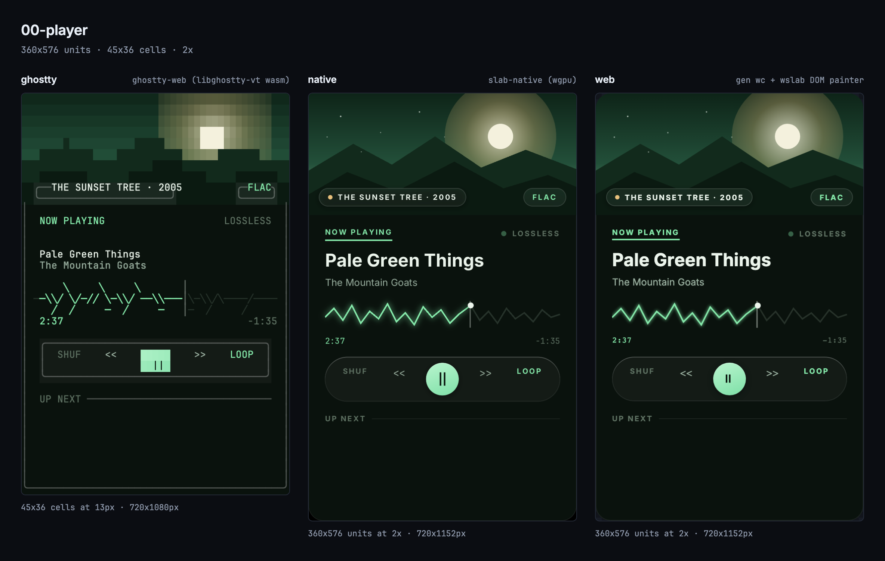

<p align="center">
  
</p>
<h1 align="center">slab</h1>
<p align="center"><i>a design language for agents</i></p>

<p align="center">
  <code>.slab</code> text compiles to a small binary IR. One deterministic Rust kernel solves
  layout, animation, and interaction — native, web, and terminal drivers just paint the same frames.
</p>

---

<p align="center">
  
  <br>
  <sub><code>examples/00-player.slab</code> — one document, three drivers, one kernel · <code>just compare 00-player</code></sub>
</p>

---

> [!WARNING]
> **Pre-alpha.** Slab is an early research project. The language, the SLIR binary format, and
> every kernel API change without notice, and **no maintenance expectation should be made at this
> stage** — issues and PRs are welcome but may go unanswered, and releases may break you. If you
> build on it today, pin exact versions and expect to keep up with churn yourself.

## The idea

Agent-authored UI needs to be **deterministic and diffable**: no flexbox surprises, no
per-platform reimplementation, no drift between what was designed and what rendered.

So Slab has exactly one solver. A compiler lowers `.slab` source to SLIR (a compact Protobuf
document), and a single hand-maintained Rust kernel (`crates/slab-kernel`) evaluates layout,
responsive conditions, animation, hit-testing, focus, text editing, and event dispatch. Drivers —
generated web components, a native wgpu window, an interactive TUI, static SVG/PNG/APNG — only
translate input events in and paint frames out. Native and WASM conformance runners check every
case against the same byte-identical goldens.

## A taste

```text
tokens {
  color { night #0A120D; ink #ECF5EC; mint oklch(86% 0.13 155); moss #1B2E22 }
  text  { label { family "Inter"; size 10; weight 700; tracking 1.6 } }
}

params {
  title   text = "Pale Green Things"
  playing bool = true
}

def Track(no, title) export {
  row focusable act=pick pad=8,12 gap=12 radius=10 {
    when hover { bg=color.moss }
    text no style=text.label color=color.mint
    text title color=color.ink w=fill ellipsis nowrap
  }
}

col w=360 pad=20 gap=12 bg=color.night radius=20 {
  text param.title size=24 weight=800 color=color.ink
  row#play focusable act=toggle pad=10,18 w=hug radius=999 bg=color.mint {
    when hover    { bg=#CDF9DC }
    when !playing { opacity=0.6 }
    text "PLAY" style=text.label color=#08130C
  }
  hole queue w=fill h=96 scroll
}
```

Design tokens, typed host params, exported components, declarative state (`when hover`,
`when !playing`), signals (`act=toggle`), and host-filled `hole`s — the full grammar and runtime
semantics live in [`spec/SPEC.md`](spec/SPEC.md), and [`examples/`](examples/) holds fourteen
complete documents.

## Try it

No Rust toolchain required — the compiler and kernel ship as WASM inside the npm CLI
(Bun or Node ≥ 20):

```sh
bunx @stencil-hq/slab render examples/00-player.slab -o player.png --width 360
bunx @stencil-hq/slab check doc.slab                  # SPEC §12 diagnostics
bunx @stencil-hq/slab gen wc doc.slab -o dist --tag my-doc
```

Or open the **[live playground](https://stencil-hq.github.io/slab/)** — editor, live preview,
design mode, and a real terminal surface, all running the same kernel as WASM in your browser.

`render` infers the output from the extension (`.svg`, `.png`, `.apng`, `.txt`); `--client tui`
with no `-o` writes cells to stdout. `--theme NAME` selects a compiled theme and rejects unknown
names. Scalar inputs use `--set name=value`; typed list inputs take JSON arrays
(`--set 'tracks=[{"title":"A"}]'`) and are rejected atomically when invalid.

## In a page

`gen wc` emits a component ES module plus the shared runtime and kernel WASM sidecar. No bundler:

```html
<my-doc id="host" title="Settings" theme="dusk" style="display:block;width:800px;height:640px"></my-doc>
<script type="module">
	import "./dist/doc.js";
	const host = document.getElementById("host");
	host.addEventListener("save", () => {}); // signals → CustomEvents
	host.title = "Hello";                    // params → properties
	host.tracks = [{ title: "First" }];      // typed lists → each rows
</script>
```

Params, typed lists, and `theme` are attributes *and* properties. Declared signals fire as
`CustomEvent`s (edited text in `detail.text`, `each`-row keys in `detail.item`); `hole`s become
named `<slot>`s; multiline fields use the kernel's caret/navigation/undo model. Layout re-solves
client-side on resize, dark-scheme, and pointer changes — no server.

## Native, terminal, Rust

```sh
cargo install --git https://github.com/stencil-hq/slab slab-cli    # native `slab` binary
cargo run -p slab-native -- --demo settings                        # wgpu window
cargo run -p slab-tui -- examples/10-settings.slab --theme dusk    # interactive TUI
cargo run -p slab-tui -- --examples                                # browse all examples
cargo run -p slab-cli -- render examples/07-monitor.slab -o monitor.apng --dur 3 --fps 12
```

`slab gen rust FILE -o OUT.rs` emits a typed module over the kernel — scalar params, typed list
item structs and setters, item-aware signals, holes, and `Doc::set_theme`.
`slab gen go FILE -o OUT.go` emits the same typed surface for Go, wrapping a
`slab.Session` from the `github.com/stencil-hq/slab-go/slab` runtime around the
document's SLIR bytes, lowered at generation time.

## Packages

| Package | What it is |
|---|---|
| [`@stencil-hq/slab`](packages/slab) | WASM-backed CLI: compile, check, render, generate — no Rust install. |
| [`@stencil-hq/wslab`](clients/web) | Web runtime: `SlabElement` base class, DOM painter, kernel WASM sidecar. |
| [`@stencil-hq/dslab`](packages/dslab) | Typed client + CLI for the Slab Drive Protocol (live kernel sessions). |
| [`slab-go`](clients/go) | Go module `github.com/stencil-hq/slab-go`: `slab` runtime over the kernel WASM (wazero) plus the `slabtui` terminal driver. |
| [`slab-lang`](packages/pyslab) | Python `slab` package: the same runtime over wasmtime, plus a terminal driver and `python -m slab FILE.slab`. |

The Go and Python clients embed `slab_abi.wasm.gz` and speak SDP in process
([`spec/SDP.md`](spec/SDP.md) §7), so neither needs a Rust toolchain or a
separate compiler binary. Generated Go modules load their precompiled SLIR with
`doc.open_slir`; the Python client compiles `.slab` source at runtime with
`doc.open`.

## Developing

Prerequisites: Rust stable (edition 2024), [Bun](https://bun.sh), [`just`](https://github.com/casey/just),
and `rustup target add wasm32-unknown-unknown` for anything touching WASM. The pinned
`wasm-bindgen-cli` is resolved automatically from `Cargo.lock`.

```sh
bun install
just check       # rustfmt, clippy -D warnings, Biome, tree-sitter
just test        # cargo test --workspace
just conformance # native + WASM against byte-exact shared goldens
just gen         # regenerate committed derived artifacts (kernel WASM, runtime bundle, caps, …)
just ci          # all of the above + generated-artifact freshness
just site        # build the playground into site/dist   (`just dev` for watch + reload)
just compare     # one document through ghostty, wgpu, and DOM, side by side
```

Generated artifacts are committed and drift-checked: edit their inputs (`spec/slir.proto`,
`spec/support.toml`, …), run `just gen`, and `just ci` fails on staleness. The single committed
kernel WASM lives in `clients/web/wasm/` and is shared by the runtime, the playground, and
`gen wc` output. Publishing runs from CI on a `v*` tag.

## Repo map

| Path | Purpose |
|---|---|
| `crates/slab-syntax` · `slab-compile` · `slab-slir` | Lex/parse/format → semantic lowering → binary IR. |
| `crates/slab-kernel` | The one solver: layout, animation, interaction, editing, dispatch. |
| `crates/slab-{cli,tui,native,lsp,wasm}` | Command line, terminal, wgpu, language server, and browser hosts. |
| `clients/web` · `packages/slab` · `packages/dslab` | The three npm packages. |
| `crates/slab-abi` · `clients/go` · `packages/pyslab` | Embeddable SDP ABI (WASM) and the Go and Python runtimes built on it. |
| `site/` | The playground (GitHub Pages). |
| `conformance/` | Shared cases and goldens; native and WASM must match byte for byte. |
| `spec/` | `SPEC.md`, `SLIR.md`, `FRAME.md`, [`SDP.md`](spec/SDP.md), `support.toml` — the normative contracts. |
| `tree-sitter-slab/` | Editor grammar, corpus-tested against `examples/`. |

## License

[MIT](LICENSE). Inter and JetBrains Mono are vendored under `assets/fonts/` (OFL) for fallback
metrics and paint faces; SLIR files never embed font bytes.
